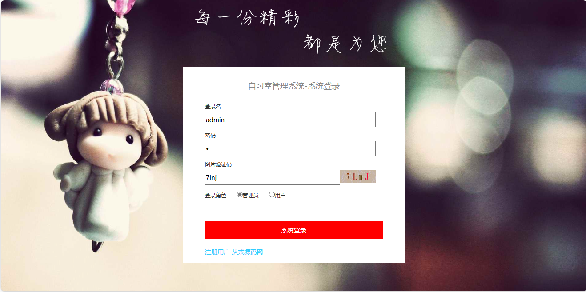
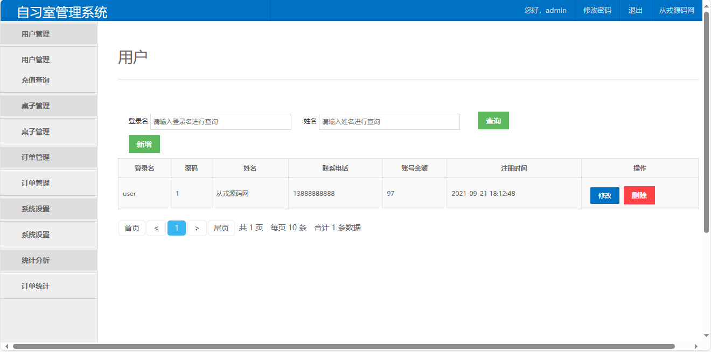
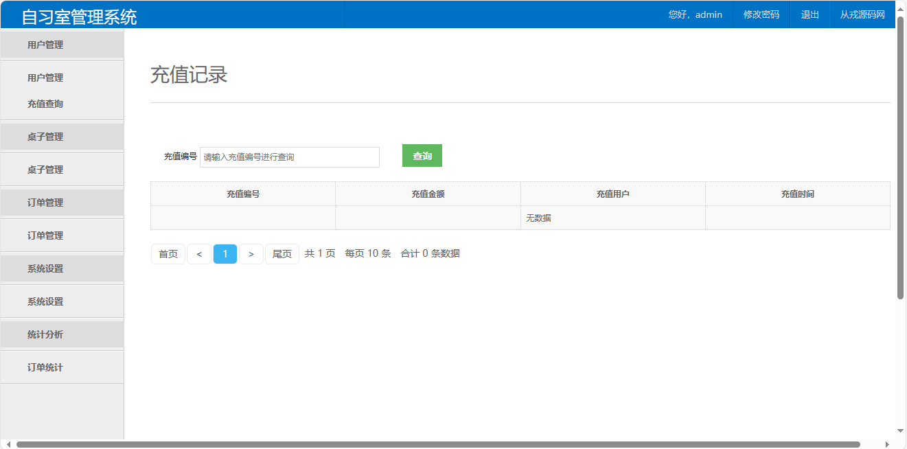
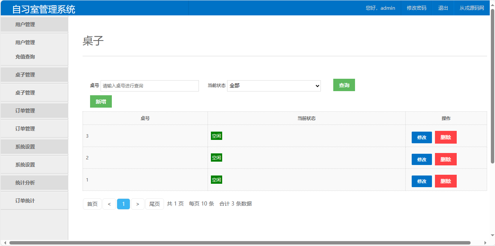
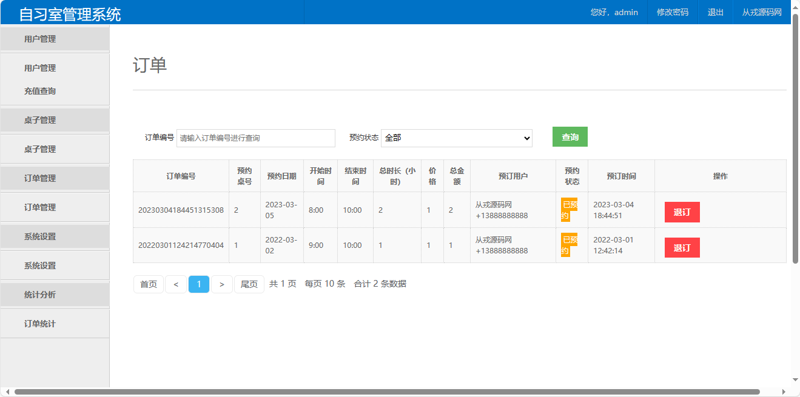
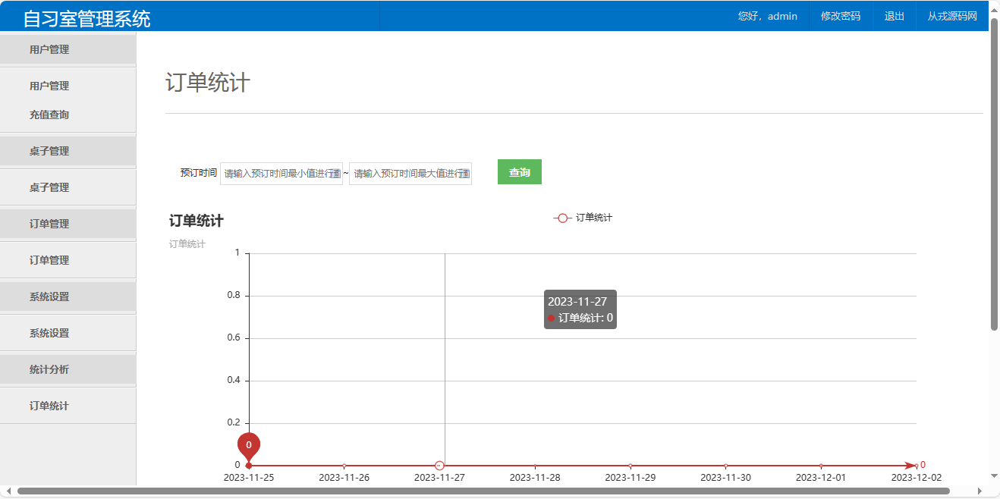
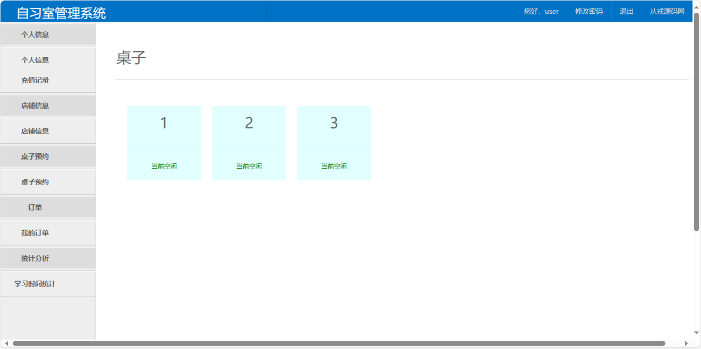
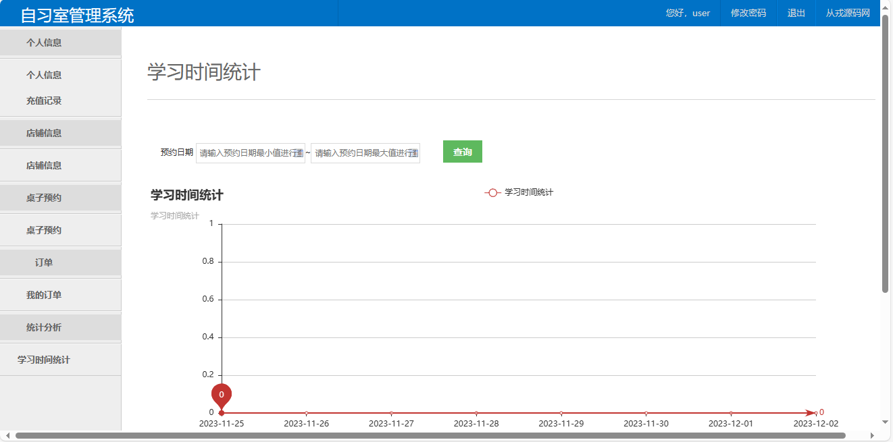

<h1 align="center">45.基于springboot的自习室管理系统</h1>

- <b>完整代码获取地址：从戎源码网 ([https://armycodes.com/](https://armycodes.com/))</b>
- <b>技术探讨、资料分享，请加QQ群：692619798</b> 
- <b>作者微信：19941326836  QQ：952045282</b> 
- <b>承接计算机毕业设计、Java毕业设计、Python毕业设计、深度学习、机器学习</b>
- <b>选题+开题报告+任务书+程序定制+安装调试+论文+答辩ppt 一条龙服务</b>
- <b>所有选题地址 ([https://github.com/YuLin-Coder/AllProjectCatalog](https://github.com/YuLin-Coder/AllProjectCatalog)) </b>

## 项目介绍
基于springboot的自习室管理系统：前端jsp、jquery、bootstrap、layui，后端 spring、mybatis，集成充值、桌子预约、学习时间统计、订单统计、订单管理等功能于一体的系统。

## 功能介绍

### 管理员

- 用户管理：用户列表、根据登录名和姓名搜索、用户信息修改、用户信息删除
- 充值查询：充值列表、充值编号查询
- 桌子管理：桌子列表、根据桌号和状态搜索、桌子信息修改、桌子信息删除
- 订单管理：订单列表、根据订单编号和预约状态搜索、订单退订
- 系统设置：系统配置信息展示、信息修改（开始时间、结束时间、价格、店铺名、简介、地址）
- 订单统计：根据预定时间区间查询、折线图表展示

### 用户

- 基本功能：登录、注册、退出、密码修改
- 个人中心：个人信息查询、个人信息修改、账户余额充值、充值记录查询、根据充值编号查询
- 店铺信息：店铺详情
- 桌子预约：桌子列表、空闲状态、点击预约、提交订单
- 我的订单：订单列表、根据订单编号和预约状态搜索、订单退订
- 学习时间统计：根据预约时间区间查询、折线图表展示

## 环境

- <b>IntelliJ IDEA 2009.3</b>

- <b>Mysql 5.7.26</b>

- <b>Maven</b>

- <b>JDK 1.8</b>

## 运行截图

